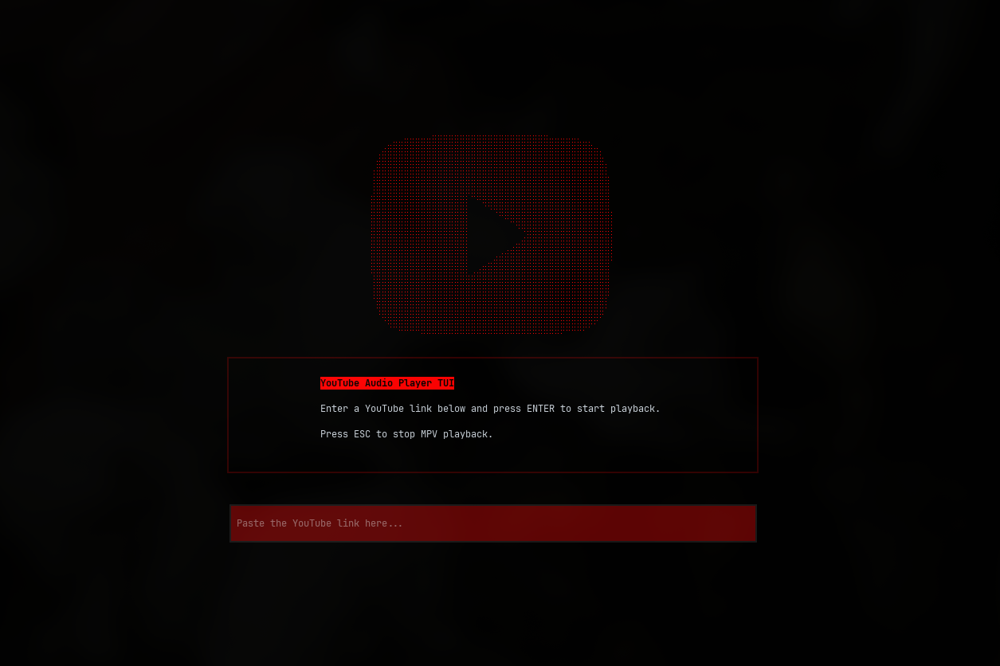

# YouTube Audio Player TUI (Textual + MPV)
## A lightweight, terminal-based YouTube audio player built with Python, Textual, and MPV.

This project is a terminal-based YouTube audio player (TUI) built using Textual, yt-dlp, and MPV.
It allows the user to *paste a YouTube link and play **audio** and **video** directly in the terminal*.


## 📸 Screenshots


## Features

* TUI interface built with Textual
* Supports YouTube links
* Audio extraction using yt-dlp
* Audio and video playback using MPV

## How It Works

* Textual controls the terminal user interface
* yt-dlp extracts the direct audio/video stream URL
* MPV is launched through a subprocess
* The TUI is temporarily suspended while MPV runs

## Requirements

* Python 3.10+
* MPV installed on the system
* pip to install dependencies

## Installation

Clone the repository:

```
git clone https://github.com/Diogojlq/youtube-player-cli.git
cd youtube-player-cli
```
Create a virtual environment and install dependencies:

```
python -m venv .venv
source .venv/bin/activate
pip install -r requirements.txt
```

Verify that MPV is available:
```
mpv --version
```
To run the app, simply run:
```
python player.py
```
And you're good to go.

### Installing MPV

* **Arch Linux:**
  ```bash
  sudo pacman -S mpv
  ``` 
* **Ubuntu/Debian:**
```bash
   sudo apt install mpv
```  
* **macOS:**
```bash
   brew install mpv
```